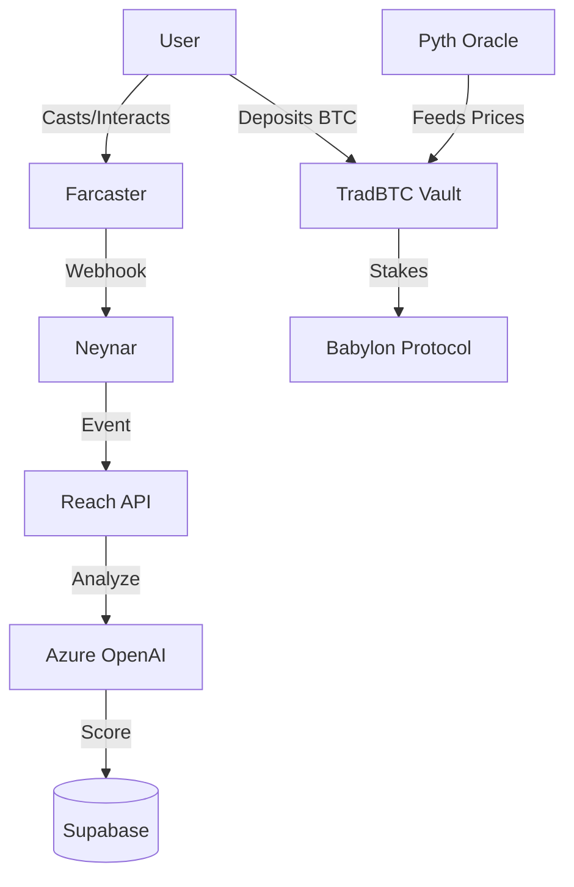

# Reach ⚡️

> **The SocialFi Layer for the New Internet.**  
> *Where Attention Meets Finance.*


---

## 🏆 Hackathon Submission

**Reach** is a cutting-edge **SocialFi** platform that bridges the gap between social engagement and decentralized finance. By combining the social power of **Farcaster** with the financial robustness of **Bitcoin DeFi**, we are creating a new economy where attention is currency and yield is accessible.

---

## 🚀 The Problem

In the current digital landscape:
1.  **Attention is Undervalued**: Users create massive value for platforms but capture little of it. "Likes" are vanity metrics, not financial assets.
2.  **DeFi is Disconnected**: High-quality financial products (like Bitcoin yield) are siloed away from where people actually spend their time—social media.
3.  **Engagement is Noisy**: It's hard to distinguish between high-quality discourse and spam/bots.

## 💡 The Solution: SocialFi

**Reach** solves this by creating a unified ecosystem:

*   **Social Layer**: We use **AI Agents** to analyze and score Farcaster engagement in real-time. It's not just about volume; it's about *quality*.
*   **DeFi Layer**: We introduce **TradBTC**, offering institutional-grade Bitcoin yields directly within the social experience.
*   **The Bridge**: Your "Reach Score" (Social Reputation) is the key to unlocking financial opportunities.

---

## ✨ Key Features

### 1. 🤖 AI-Powered Engagement Scoring
We don't just count likes. Our **Azure OpenAI** agents analyze the context, sentiment, and quality of every interaction (mentions, replies, casts).
*   **Smart Filtering**: Distinguishes between genuine conversation and "GM" spam.
*   **Real-Time Tracking**: Powered by **Neynar** webhooks.
*   **Reputation Score**: Users earn a dynamic "Reach Score" based on their contribution to the network.

### 2. 💰 TradBTC: Bitcoin Yield Vaults
Seamlessly integrated DeFi for the social user.
*   **Babylon Integration**: Stake BTC to earn trustless yield.
*   **Institutional Strategies**: Access low-risk, high-yield vaults previously reserved for whales.
*   **Live Oracles**: Powered by **Pyth Network** for real-time NAV (Net Asset Value) updates and transparency.
*   **MSTR Tracking**: Live tracking of MicroStrategy's NAV as a benchmark.

### 3. 🔐 Seamless Onboarding
*   **Privy Auth**: Login with your Farcaster account in seconds.
*   **Non-Custodial**: You own your keys and your coins.

---

## 🛠 Tech Stack

We built Reach using the best-in-class technologies for Web3 and AI:

| Category | Technology | Usage |
|----------|------------|-------|
| **Frontend** | **Next.js 15** | High-performance React framework with Blueprint UI theme. |
| **Social** | **Farcaster** | The decentralized social protocol. |
| **Auth** | **Privy** | Seamless crypto & social login. |
| **Data** | **Neynar** | Real-time Farcaster data & webhooks. |
| **AI** | **Azure OpenAI** | LLM for semantic analysis and scoring. |
| **Database** | **Supabase** | Real-time database for user profiles and scores. |
| **DeFi** | **Foundry** | Smart contract development and testing. |
| **Oracles** | **Pyth Network** | Real-time price feeds for BTC and MSTR. |
| **Staking** | **Babylon** | Bitcoin staking protocol integration. |

---

## 📸 Screenshots

| Dashboard | TradBTC Vault |
|-----------|---------------|
| *Social Engagement Tracking* | *Bitcoin Yield Interface* |
|  |  |

*(Note: Screenshots to be added)*

---

## 🏗 Architecture



---

## 🏃‍♂️ Getting Started

### Prerequisites
*   Node.js & Yarn
*   Foundry (for smart contracts)

### Installation

1.  **Clone the repo**
    ```bash
    git clone https://github.com/yourusername/reach.git
    cd reach
    ```

2.  **Install dependencies**
    ```bash
    yarn install
    ```

3.  **Set up Environment Variables**
    Copy `.env.example` to `.env.local` and fill in your keys (Privy, Supabase, Neynar, OpenAI).

4.  **Run the Development Server**
    ```bash
    yarn dev
    ```

5.  **Run Smart Contract Tests**
    ```bash
    cd mstr-nav-oracle
    forge test
    ```

---

## 🔮 What's Next?

*   **Token Launch**: Launching $REACH token to reward high-quality engagement.
*   **More Vaults**: Expanding TradBTC to include ETH and SOL strategies.
*   **DAO Governance**: Allowing high-score users to vote on vault strategies.

---

Made with ❤️ for the **SocialFi Hackathon**.
